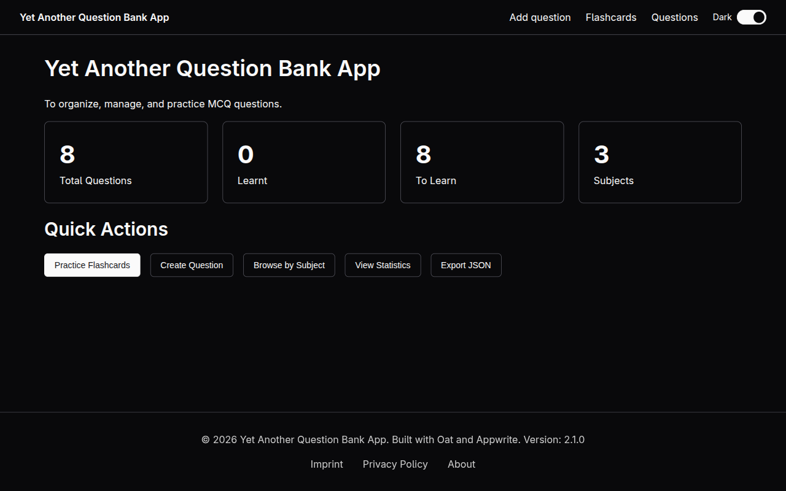
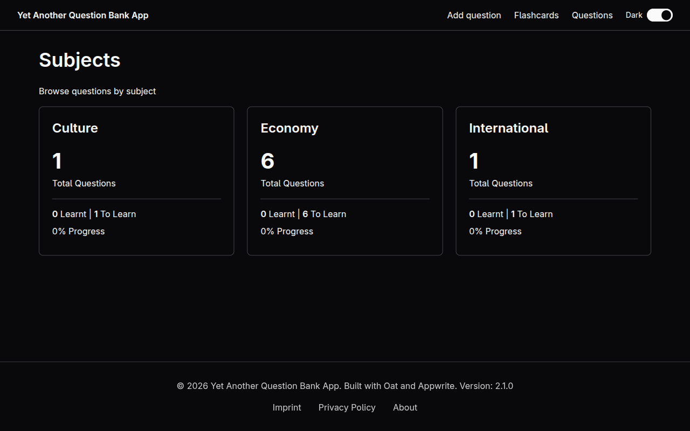

# Yet Another Question Bank App

A personal MCQ question bank — create, browse, and practice with flashcards. No build step, no framework, no dependencies to install.


## Stack

| Layer | Technology |
|---|---|
| UI | [Oat](https://github.com/knadh/oat) (CDN) |
| Routing | [Navigo](https://github.com/krasimir/navigo) (CDN) |
| Backend | [Appwrite](https://appwrite.io/) cloud |
| Serving | Go static server (Docker) or any static server |

## Features

- Create and edit multiple-choice questions (4 options, optional explanation)
- Organize questions by subject
- Flashcard study mode with shuffle and subject filter
- Mark questions as learnt to track progress
- Statistics view with per-subject breakdown
- Dark/light theme toggle

## Screenshots

### Dashboard

Stats summary and quick actions.



### Subjects

Per-subject progress overview.



## Appwrite Setup

Create a project in [Appwrite Console](https://cloud.appwrite.io), then create a database and a collection named `questions` with these fields:

| Field | Type | Size | Required | Default |
|---|---|---|---|---|
| `question` | String | 1000 | Yes | — |
| `optionA` | String | 500 | Yes | — |
| `optionB` | String | 500 | Yes | — |
| `optionC` | String | 500 | Yes | — |
| `optionD` | String | 500 | Yes | — |
| `correctAnswer` | Integer | — | Yes | — |
| `subject` | String | 100 | Yes | — |
| `explanation` | String | 2000 | No | — |
| `learnt` | Boolean | — | Yes | false |

`correctAnswer` is 0-based (0 = A, 1 = B, 2 = C, 3 = D).

Set collection permissions according to your access needs. Subjects are derived from question data — there is no separate subjects collection.

## Running locally

This is a vanilla JavaScript app with no build step or npm runtime dependencies. Choose one of these serving options:

### Run with the Go server

Copy `.env.example` to `.env` and fill in your Appwrite credentials. `make run` does not load `.env` automatically; export its values before starting the server:

```sh
cp .env.example .env
# Edit .env, then:
set -a
. ./.env
set +a
make run
```

The Go server dynamically serves `/js/config.js` from environment variables. It accepts both `APPWRITE_*` and `PUBLIC_APPWRITE_*` names. Go is required for this option.

### Use another static server

For a static server, replace the `__PLACEHOLDER__` tokens in `js/config.js` with your Appwrite credentials; `.env` is not automatically read by static servers. Then serve the directory:

```sh
npx serve .
# or
python -m http.server 5173
```

Open the URL printed by the server (typically [http://localhost:5173](http://localhost:5173)).

## Docker

Run tests:

```sh
make test
```

Build the local Go server binary, Docker image, and exported tarball:

```sh
make dist
```

Run with Docker Compose. The Go server serves `/js/config.js` from `.env` values at request time:

```sh
docker compose up -d
```

The app is available at [http://localhost:8880](http://localhost:8880).

The server reads env vars passed **without** the `PUBLIC_` prefix (i.e. `APPWRITE_ENDPOINT`, not `PUBLIC_APPWRITE_ENDPOINT`). `PUBLIC_APPWRITE_*` is accepted as a fallback.

Logs go to stdout and are visible with Docker Compose:

```sh
docker compose logs -f
LOG_LEVEL=debug docker compose up
LOG_FORMAT=json docker compose up
```

`LOG_LEVEL` supports `debug`, `info`, `warn`, and `error`; default is `info`. `LOG_FORMAT` supports `text` and `json`; default is `text`.

Security headers (`Content-Security-Policy`, `X-Content-Type-Options`, `X-Frame-Options`) and SPA fallback are handled by `server.go`.

## Project structure

```
index.html              Single HTML shell — loads CDN deps, defines header/footer
js/
  app.js                Entry point — theme toggle, calls initRouter()
  router.js             Navigo SPA router; maps URL paths to render functions;
                        also contains inline renderers for /about, /imprint, /privacy
  appwrite.js           All Appwrite CRUD (getQuestions, createQuestion, updateQuestion,
                        deleteQuestion, markAsLearnt, getSubjects, getStats)
  config.js             Appwrite config constants for local static serving;
                        Docker serves this path dynamically from env vars
  utils.js              Shared helpers (escHtml for XSS-safe innerHTML interpolation)
pages/
  home.js               Dashboard with stats summary
  questions.js          Question list with subject filter
  create.js             Create/edit form (doubles as edit when called with questionId)
  subjects.js           Subject browser with per-subject progress
  flashcards.js         Interactive study mode with shuffle and learnt tracking
  stats.js              Detailed statistics with per-subject breakdown
css/styles.css          Custom overrides on top of Oat UI
server.go               Docker static server, env config endpoint, security headers
```

Each `pages/*.js` file exports a single `render*()` function that replaces `#app-content` innerHTML and calls `updatePageLinks()` for Navigo to pick up new `data-navigo` links.

## License

MIT — see [LICENSE](LICENSE).
